# This is a Fork of Pokémon FireRed and LeafGreen by Pret
based on https://github.com/pret/pokefirered

I wanted to play this game a long time but there were some 'time waster' functions which really annoyed me. 
Then i found out that i can make changes as i wish to thanks to https://github.com/pret and his community: 
[Discord](https://discord.gg/d5dubZ3) and [IRC](https://web.libera.chat/?#pret).

I wanted the stock story (v1.1) but:
 1) without text animation character by character -> instant text mode
 2) speeded up the healath care center nurse text, especially remove the 'We Hope To See You Again'
 3) scrolling options menu - I plan to add more and more options, and they need to fit somehow 
 4) added experience gain modifyer
 5) option to skip the quest log  
 6) added experience share ratio modifier
 7) added ability to show EV and IV in the Summary screen
 8) added type effectiveness to move chose screen

I also need to say a huge thanks to the creators of the following repos which contained the stuff i needed (among lot more) in some form:\
https://github.com/Deokishisu/FRLG-Plus  
https://github.com/TheXaman/pokeemerald/tree/tx_optionsPlus  
https://github.com/pret/pokeemerald/wiki/Tutorials  
 
 
From the wishlist I managed to accomplish:
 1) instant text mode. I modifyed the hack from Deokishisu so that when somebody want's to say 
a lot more than 2 lines, the wait function will be still active, so i can read the content. 
For eample in case of a 6 line text it will be: 2 lines (line 1 and 2) instant, wait for BUTTON_A, 
2 more lines (line 3 and 4) instant, wait for BUTTON_A, final lines, 
wait for BUTTON_A. As opposed to the original Deokishisu hack which blinks for a fraction of a 
second the first 2 pages (lines 1,2 then 3,4) and you stay with the fianl one.
 2) this was a quick one, just one liners on EventScript and in pkmn_center_nurse script
 3) based on https://www.pokecommunity.com/showpost.php?p=10275248 which is basically https://github.com/TheXaman/pokeemerald/tree/tx_optionsPlus 
i was able to modify the menu system of the firered in the same manner. 
There was lot of differences in code but the result is the same. The only visible difference is that we firered has 6 lines
while TheXaman's emerald has 7. 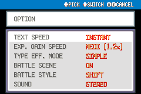 
 4) this was a nice exercise. Adding new option item with value formatting and the modifier itself.\
Still 100% backward compatible, as i have chosen an unused area from SaveBlock2.\
Player can now chose from 0.5x, 0.8x, 1x, 1.2x, 1.5x, 2x, 2.5x, 3x experince gain multiplier. 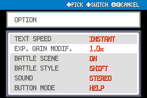 
 5)  I found it especially time consuming during debug to look at the quest log all the times. 
So i found a way to skip it, then i thought why not to have this also as an option.
The option uses an unoccupied SaveBlock2 address, therefore it is 100% backward compatible with the stock game.\
Actually here it was more work to add the actual menu item then the function
 6)  Originally when a mon holds an item 'exp share' it gets a share from exp from the battling mons in an 50:50 manner. 
Now this ratio can be adjusted.\
For example 10:90 will mean that the total exp of 333 will be divided into 33 to 300 ratio in between battling and resting mons
resting mon = the one who has the hold item and was not battling\
This comes especially handy when you need to level up a mon quickly, which otherwise can't battle as it's too weak 
 7) Wagely based on https://www.pokecommunity.com/showpost.php?p=10161688&postcount=77 \
For Firered the code was different, so i needed to improvise. Also the `R_BUTTON` `L_BUTTON` (not `DPAD_LEFT` `DPAD_RIGHT`) was not really working in FireRed. 
But it(interfering with the Help system, but also after disabling that the `R_BUTTON` `L_BUTTON` was misbehaving).\
So why not to use the `A_BUTTON` as on other summary screens? So i decided to do so. Each subsequent press of `A_BUTTON` will forward the screen to the next mode
Skills -> EV -> IV -> Skills...\
Mine also updates the page text, so you know on which you are on. 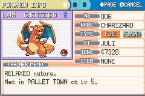
 8) as first step added the menu option to be able to select between different modes of type effectiveness. Still 100% backward compatible, as i have chosen an unused area from SaveBlock2.\
As the next step i added (next to the original one) the v1 (in options called simple) mode which calculates the
two type ecffectivenes together with STAB. Some examples:
    
  * Charmeleon `FIRE` using Ember `FIRE` on Paras `BUG` `GRASS` -> 600% = double type strength, has STAB 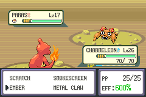
  * Pikachu `ELECTRIC` using Thunder Shock `ELECTRIC` on Pidgey `NORMAL` `FLYING` -> 300% = type strength and STAB 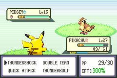
  * Charmander `FIRE` using Ember `FIRE` on Pidgey `NORMAL` `FLYING` -> 150% = no type strength or weakness, but has STAB 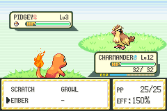
  * Pikachu `ELECTRIC` using Quick Attack `NORMAL` on Pidgey `NORMAL` `FLYING` -> 100% = no type strength or weakness, no STAB 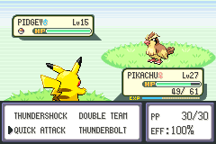
  * Charmander `FIRE` using Ember `FIRE` on Geodude `ROCK` `GROUND` -> 75% = type weakness, but has STAB 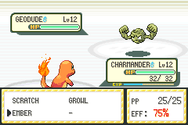
  * Charmander `FIRE` using Scratch `NORMAL` on Geodude `ROCK` `GROUND` -> 50% = type weakness, no STAB 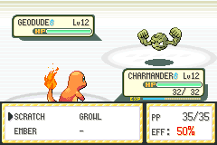
  * Pidgeotto `NORMAL` `FLYING` using Gust `FLYING` on Magnemite `STEEL` `ELECTRIC` -> 37.5% = double type weakness, has STAB 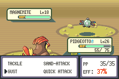
  * Dugtrio `GROUND` using Dig `GROUND` on Pidgey `NORMAL` `FLYING` -> 0% (Immune) = type weakness, has STAB but does not matter 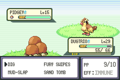
  * Status moves has no coloring, as they have are (in mayority) not affected by type 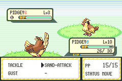

All the possible values are:
   * 25% double type weakness, no STAB
   * 37.5% double type weakness, has STAB
   * 50% single type weakness, no STAB
   * 75% single type weakness, has STAB
   * 100% no type advance, no STAB
   * 150% no type advance, has  STAB
   * 200% single type strength, no STAB
   * 300% single type strength, has STAB
   * 400% double type strength, no STAB
   * 600% double type strength, has STAB

   **Note:** The coloring respects the in game texts `super effective` and `not very effective` so even if you have a STAB move with 150% it will stay uncolored
  
 
To set up the repository, see [INSTALL.md](INSTALL.md), or wisit the original author's page.
